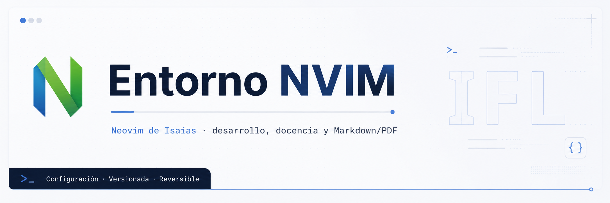

# 


*Neovim de Isaías: desarrollo, docencia y Markdown/PDF.*

**[Guía completa de teclas y uso](docs/guia-completa-teclas.md)**: editor,
explorador, pestañas, tmux, consola, IA, PDF, autocompletado y LazyGit.

**[Chuleta para alumnado](chuleta_comandos.md)**: instalación, perfiles,
sesiones tmux, edición básica en Neovim, diagnósticos y ejecución de Bash.

## Qué es

La evolucion docente portable ya dispone de perfiles y arranque minimo sin
dependencias opcionales. Consulte [estado y uso actual](docs/entorno-docente.md).
La V1 descrita mas abajo es la referencia historica completa en Debian;
esta fase se prueba en Omarchy y aun no certifica WSL2.

`entorno-nvim` v1.0.0 es una configuración de Neovim y tmux comprensible,
versionada y reversible para programación, docencia y documentos Markdown.
La referencia probada es Debian 13 con Neovim 0.12.4.

## Qué incluye

- Neovim modular en Lua, dashboard IFL, búsqueda, explorador y Git.
- LSP nativo para Lua, web y Python; completado nativo de Neovim 0.12.
- Tree-sitter con ocho parsers externos fijados.
- sesiones tmux por proyecto en el socket dedicado `entorno-nvim`;
- Markdown → HTML/CSS → Chromium → PDF A4 (Pandoc opcional, sólo para PDF).

El [inventario V1](docs/inventario-v1.md) detalla componentes y versiones.

## Instalación rápida para alumnado

Para una primera clase en Ubuntu, Pop!_OS o WSL2 usa el carril mínimo:

```sh
git clone https://github.com/isaiasfl/entorno-nvim.git
cd entorno-nvim
./scripts/instalar-alumno.sh --sistema
entorno-dev --perfil si --ia
```

Prepara Git, tmux, `fzf`, `fd/fdfind`, ripgrep, Neovim y Node 24 locales,
plugins fijados, Pyright, Bash Language Server y ShellCheck para diagnósticos
de scripts. No instala Pandoc, Chromium, Poppler ni
herramientas PDF. Tampoco toca `~/.config/nvim` ni usa un posible Neovim de
Windows desde WSL2.

El último comando abre la carpeta actual. Para abrir un proyecto concreto:

```sh
entorno-dev --perfil si --ia /ruta/a/mi-proyecto
```

La IA solo se abre si ya existe un cliente compatible configurado; el editor y
tmux funcionan sin él. El instalador crea de forma segura el comando en
`~/.local/bin/entorno-dev` y no sobrescribe archivos ajenos. Si la terminal
actual todavía no incluye esa carpeta en `PATH`, muestra cómo activarla.
`./scripts/instalar-alumno.sh --comprobar` diagnostica esta instalación sin
modificar nada.

## Instalación completa

El perfil del profesor y las prácticas posteriores con LSP, parsers y PDF usan:

```sh
./scripts/comprobar-requisitos.sh
./scripts/instalar.sh
./bin/entorno-dev --perfil profesor
```

El instalador es idempotente, no usa `sudo`, no activa la configuración y no
elimina instalaciones anteriores. Comprueba qué falta, separa imprescindibles de
opcionales y descarga Node 24 LTS verificado dentro del repositorio, así que no
hace falta preparar Node a mano. Si faltan paquetes del sistema, muestra el
comando exacto y se detiene; con `./scripts/instalar.sh --sistema` ofrece
ejecutarlo con `sudo` tras pedir confirmación. Pensado para WSL2, Debian/Ubuntu
y Arch/CachyOS; guía paso a paso en [alumno.md](docs/alumno.md). Véase también
[instalación V1](docs/instalacion.md).

## Comprobar requisitos

```sh
./scripts/comprobar-requisitos.sh
```

Solo lee el estado y clasifica cada elemento como `OK`, `FALTA` u `OPCIONAL`.

## Activación histórica V1 (no necesaria para el entorno docente)

Este procedimiento sustituye el Neovim habitual. **No usarlo para convivir
con Omarchy**; el lanzador separado de arriba no necesita activacion.

```sh
./scripts/activar.sh
```

Crea un backup fechado y enlaza `~/.config/nvim` al directorio `nvim/` del
repositorio. No modifica la configuración tmux personal. Detalles en
[activación](docs/activacion.md).

## Restaurar

```sh
./scripts/restaurar.sh
```

Restaura la configuración y el comando de Neovim anteriores desde el último
backup registrado. El backup histórico se conserva. Véase
[restauración](docs/restauracion.md).

## Flujo diario

```sh
cd /ruta/al/proyecto
/ruta/entorno-nvim/bin/entorno-dev --perfil dwec
```

Sin opciones recupera el perfil profesor, PDF y tmux con tres paneles.
`--sin-tmux` abre solo Neovim; `--sin-ia` omite el agente.
La [guia docente](docs/entorno-docente.md)
describe los perfiles y la [chuleta diaria](docs/chuleta.md) los atajos.
El lanzador acepta otra ruta con `entorno-dev /ruta` y abre el selector con
`entorno-dev --elegir`. Use `./bin/entorno-dev` o su ruta absoluta; el enlace
opcional en `~/.local/bin` solo se crea con `scripts/instalar-entorno-dev.sh`.

## Neovim

`./scripts/arrancar.sh` ejecuta Neovim con datos, cache y estado aislados.
Conserva el runtime del escritorio y separa sus propios sockets y contextos.
No cambia la configuracion activa. [Arquitectura docente](docs/entorno-docente.md).

## tmux

El flujo usa `tmux -L entorno-nvim` y no carga ni altera `~/.tmux.conf`.
`Ctrl-a P` abre el selector de proyectos en un popup; el ratón queda disponible
como apoyo y la navegación principal sigue siendo por teclado. `Ctrl-a ?` abre
una ayuda interactiva por categorías para el flujo diario, editor, IA, espacio
de trabajo tmux, Git, terminal, navegación y configuración. Más detalles en
[terminal y tmux](docs/terminal-tmux-agentes.md).

## Agentes

El panel derecho admite agentes CLI intercambiables. `<leader>ac` pega contexto
solo tras validar el proceso de destino y nunca envía Enter. El entorno no
instala agentes ni gestiona sus credenciales.

## Markdown/PDF

`<leader>mp` genera el PDF real y `<leader>mv` lo genera y abre en el visor
externo. Cabecera y pie usan `module`, `centre` y `teacher` del YAML. Véase
[Markdown/PDF](docs/markdown-pdf.md).

## LSP

LuaLS 3.19.0, los servidores web fijados, Pyright 1.1.411 y Bash Language
Server 5.6.0 se instalan de forma aislada, sin Mason ni npm global. Véase
[LSP y completado](docs/lsp.md).

## Mappings principales

| Mapa | Acción |
| --- | --- |
| `<leader>w` | Guardar |
| `<leader>d` | Duplicar la línea actual |
| `Alt-Shift-j/k` / `Cmd-Shift-↓/↑` | Mover líneas o selecciones |
| `<leader>gg` | Lazygit |
| `<leader>mp` / `<leader>mv` | Generar PDF / generar y visualizar |
| `<leader>ac` | Pegar contexto revisable en el agente |
| `<leader>ut` | Elegir Catppuccin, Tokyo Night o Kanagawa |
| `gd`, `grr`, `grn`, `K` | Definición, referencias, rename y hover LSP |
| `Ctrl-h/j/k/l` | Navegar splits de Neovim |
| `Ctrl-a h/j/k/l` | Navegar paneles tmux |
| `Ctrl-a P` | Selector de proyectos tmux |

## Portabilidad

Probado: Debian 13 x86_64. Objetivo no probado: Arch/CachyOS x86_64 y macOS
moderno. Los scripts evitan incompatibilidades BSD evidentes, pero no se afirma
validación real fuera de Debian. Consulta [instalación V1](docs/instalacion.md).

## Seguridad

No se versionan secretos, estado de editores, credenciales ni configuraciones
privadas de agentes. El contexto hacia agentes tiene una barrera preventiva,
no un DLP. El compilador PDF solo está diseñado para Markdown propio y fiable.

## Actualización

Actualizar una versión fijada exige revisar origen, checksum o lockfile,
ejecutar `./scripts/comprobar.sh` y revisar el diff antes de confirmar. No hay
actualizaciones automáticas de plugins, parsers ni LSP.

## Desinstalación

El modo portable no requiere restaurar Neovim: no lo sustituye. Antes de
retirar el entorno, cierre sus procesos y conserve sus proyectos y documentos.
Solo quien activo la V1 mediante `activar.sh` necesita el procedimiento
historico de restauracion. El proyecto nunca borra backups automaticamente.

## Licencia

MIT © 2026 Isaías Fernández Lozano
